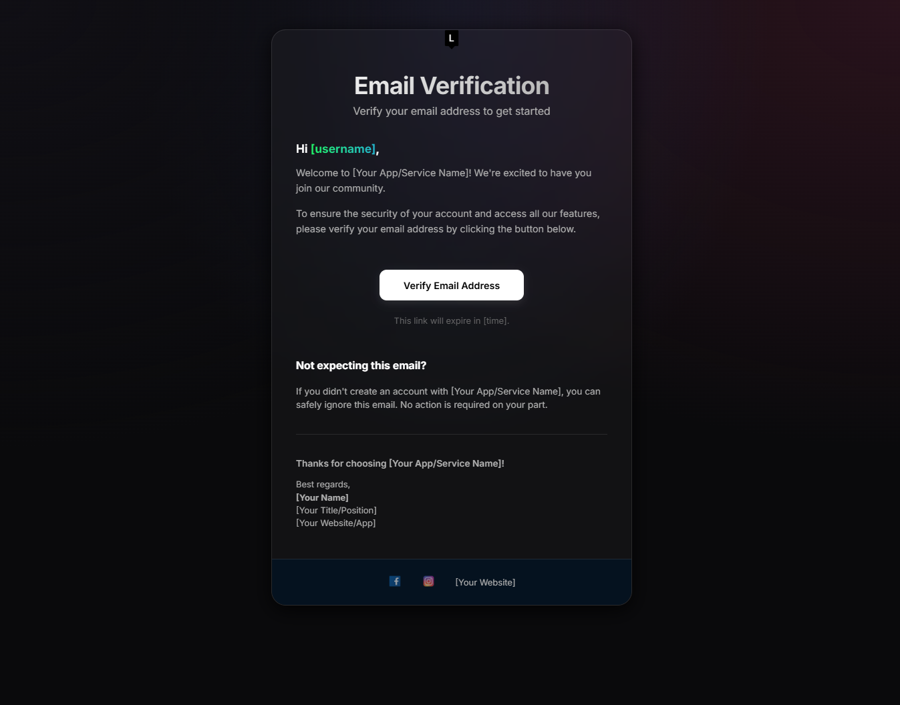

# Email Template

A premium, modern, and dark-themed HTML/CSS email verification template featuring a sleek glassmorphism design. Perfect for startups and modern web applications.

## Features

- **Modern Dark Design:** A high-contrast dark theme with subtle gradients for a premium look.
- **Glassmorphism:** Elegant frosted glass effect using `backdrop-filter` and semi-transparent backgrounds.
- **Responsive:** Fully responsive design that scales beautifully from mobile to desktop.
- **Easy Customization:** Clearly marked placeholders for branding, links, and personal information.
- **Inter Font:** Integrated with the Inter font family for superior readability and modern aesthetics.

## Preview



## Getting Started

1. **Clone the repository:**
    ```bash
    git clone https://github.com/rajjitlai/Email_Template.git
    ```

2. **Open the template:**
    Open `index.html` in your browser to preview the design.

3. **Customize:**
    - Update `[Your App/Service Name]`, `[username]`, and other placeholders in `index.html`.
    - Replace images in the `images/` directory with your own branding.
    - Adjust colors and styles in `css/style.css` if needed.

## Usage

This template is designed for email verification but can be easily adapted for password resets, welcome emails, or notifications. 

*Note: For maximum compatibility across legacy email clients (like older versions of Outlook), it is recommended to inline your CSS and test thoroughly using tools like Litmus or Email on Acid.*

## Contributing

Suggestions and improvements are welcome! Feel free to open an issue or submit a pull request.

## License

This project is licensed under the MIT License - see the [License](License) file for details.

## Acknowledgments

- Built with modern HTML5 & CSS3.
- Focused on aesthetics and user experience.
- Design inspired by modern SaaS and Fintech UI trends.
